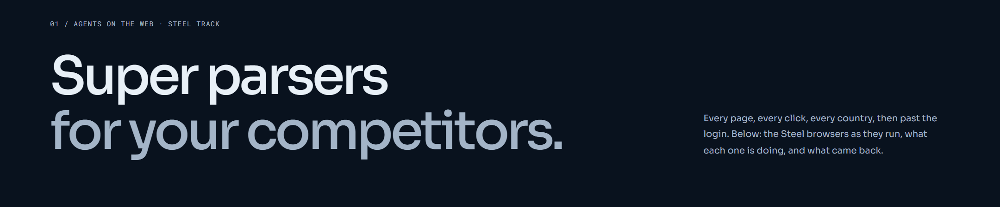
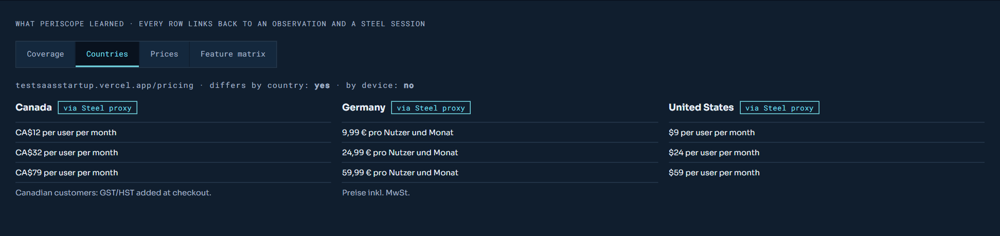
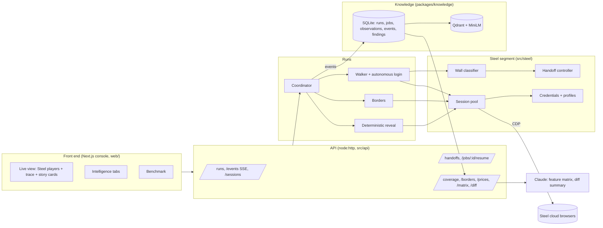
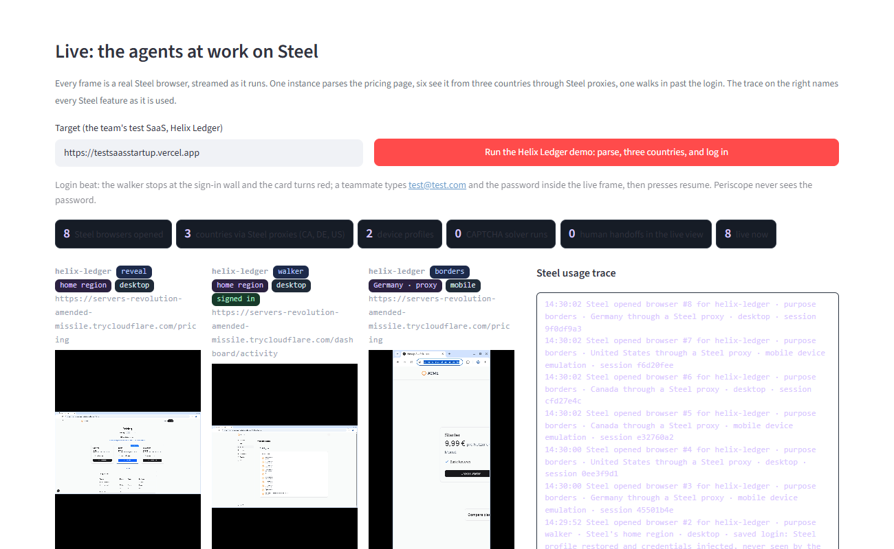
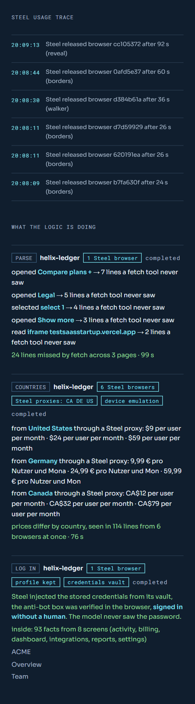
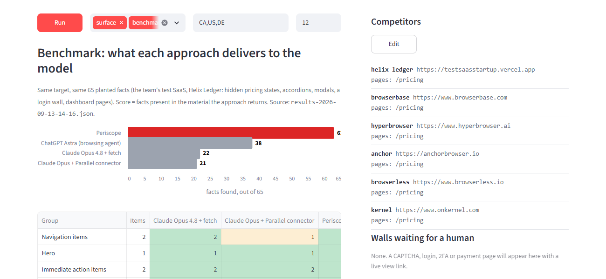

# Periscope

<p align="center">
  
</p>

<p align="center">
  <a href="https://steel.dev"></a>
  
  
  
  
  
  
  
  
  
  
  
</p>

**Super parsers for your competitors. Every page, every click, every country, then past the login.**

Every research tool reads what a website serves. Periscope reads what a website hides: the pricing behind the annual toggle, the limits inside an accordion, the price a customer in Germany sees, the plan facts that only exist inside the product after sign-in. It runs on [Steel](https://steel.dev) cloud browsers and turns a competitor's whole web space into evidence-linked intelligence.

Built at the UTMIST × WAT.ai *Battle of the Schools* hackathon (September 12–13, 2026) for the Steel "Agents on the web" track.

---

## Contents

- [Why this exists](#why-this-exists)
- [What it does](#what-it-does)
- [How it uses Steel](#how-it-uses-steel)
- [Architecture](#architecture)
- [Quick start](#quick-start)
- [The demo](#the-demo)
- [API](#api)
- [Command line](#command-line)
- [Data model](#data-model)
- [Testing](#testing)
- [Benchmark](#benchmark)
- [Safety and secrets](#safety-and-secrets)
- [Known limitations](#known-limitations)
- [Repository layout](#repository-layout)
- [Team](#team)

---

## Built with

<p align="center">
  &nbsp;&nbsp;&nbsp;
  &nbsp;&nbsp;&nbsp;
  &nbsp;&nbsp;&nbsp;
  &nbsp;&nbsp;&nbsp;
  &nbsp;&nbsp;&nbsp;
  &nbsp;&nbsp;&nbsp;
  &nbsp;&nbsp;&nbsp;
  &nbsp;&nbsp;&nbsp;
  &nbsp;&nbsp;&nbsp;
  &nbsp;&nbsp;&nbsp;
  &nbsp;&nbsp;&nbsp;
  &nbsp;&nbsp;&nbsp;
  &nbsp;&nbsp;&nbsp;
  
</p>

| | |
|---|---|
| **Browsers** | [Steel](https://steel.dev) cloud sessions over CDP, driven with `playwright-core`; [Stagehand](https://github.com/browserbase/stagehand) v4 attaches on top when a model key is present |
| **Language and runtime** | TypeScript on Node 24, `pnpm` workspaces (`packages/contracts`, `packages/knowledge`), `tsx` for scripts |
| **Model** | Claude Opus 5 through the Anthropic SDK, forced tool schemas, every extracted row bound to observation ids |
| **Storage** | SQLite (`better-sqlite3`, versioned migrations, micro-dollar accounting), Qdrant for vectors, MiniLM embeddings |
| **API** | Dependency-free `node:http`: JSON routes, server-sent events, idempotency keys |
| **Front end** | Next.js 16 static console (`web/`), Vercel-ready, with Steel's live session player embedded per browser; the earlier Streamlit app (`frontend/`) is kept as a run browser |
| **Tests** | Vitest, local Chrome against HTML fixtures, in-memory SQLite, fake Steel segment and fake model |
| **Test target** | Helix Ledger, a Next.js SaaS built for the benchmark, deployed on Vercel and reachable through a Cloudflare tunnel |

---

## Why this exists

Fetch-based research tools, search indexes and "reader" APIs return the HTML a server sends. Modern SaaS sites keep the interesting facts behind client-side state: a Monthly/Annual switch, a "Compare plans" accordion, a seat-count dropdown, a hover tooltip, a "Show more" button, an iframe calculator, a JSON call made on page load, a cookie wall that differs by country, and a login. None of that is in the response body, so none of it reaches the model.

Periscope's wedge is that it drives real browsers: it performs the clicks, sees the page from several countries and devices at once, keeps the session alive when a wall appears so a person can clear it in Steel's live view, and signs in with credentials that live in Steel's vault rather than in the model's context. Every line it records carries the action that revealed it, the country and device it was seen from, and the Steel session that produced it.

## What it does

Periscope runs four kinds of job against a competitor:

| Job | What happens | Layer of the result |
|---|---|---|
| **surface** | Steel's scrape endpoint fetches the page the way a fetch tool would | `surface` |
| **benchmark** | A plain HTTP fetch of the same page, stored as its own sightings so the two can be compared honestly | `surface`, source `benchmark_fetch` |
| **reveal** | A Steel browser loads the page and a deterministic strategy set clicks, toggles, selects, hovers, scrolls and opens everything a fetch tool cannot; every new visible line becomes an observation with `missedByFetch` set when the surface never contained it | `hidden` |
| **borders** | The same page opened in parallel from several countries (Steel proxies) and devices (Steel device emulation); a grid shows what each vantage saw that the others did not | `borders` |
| **walker** | A crawl of the signed-in web space: same-origin links only, one observation per visible line per screen, a wall check after every navigation, autonomous sign-in with vaulted credentials, human handoff as the fallback | `interior` |

On top of the observations, the intelligence layer produces coverage per page, the borders grid, a pricing table, a run-to-run diff, and a feature matrix extracted by Claude with every row bound to observation ids. The web console shows the live browsers, a plain-language trace of what the agents and Steel are doing, one story card per run, and the intelligence beneath.

<p align="center">
  
</p>

## How it uses Steel

| Steel feature | Where Periscope uses it |
|---|---|
| **Sessions over CDP** | Every reveal, borders and walker job; Playwright drives the page, Stagehand can attach on top |
| **Session pool discipline** | Ten concurrent sessions, 11-minute autonomous deadline with checkpoint, forced release at 14 minutes, crash journal and reconcile on start (`src/steel/pool.ts`) |
| **Proxies by country** | Borders jobs open the page from CA, US and DE at once (`useProxy.geolocation`) |
| **Device emulation** | Each country is opened on desktop and mobile |
| **Live session player** | Embedded on the front end for every open session; also the place a person clears a wall |
| **CAPTCHA solver** | Tried first on every CAPTCHA wall; a human is called only if it fails or times out |
| **Credentials vault** | Passwords are stored in Steel (`credentials.create`) and injected into the sign-in form by Steel; the model and the codebase never see them |
| **Profiles** | Walker sessions persist their profile so a login survives for later walks |
| **Scrape endpoint** | The surface pass; markdown output is used because readability is empty on Framer-style sites |
| **Extensions API** | Stagehand's runtime extension is uploaded once and installed into model-driven sessions (`src/steel/stagehand-extension.ts`) |
| **Files and traces** | Exportable per session for evidence |

## Architecture



Eight layers, three owners, one shared contract (`packages/contracts`):

| Layer | Responsibility | Owner |
|---|---|---|
| 1. Browser | Steel adapter, session pool, profiles, credentials | Fahad |
| 2. Agent | Surface, reveal, borders, walker, perception, policy, meter | Tom (Person B) |
| 3. Login | Vaulted credentials, autonomous sign-in, saved profiles | Fahad |
| 4. Human in the loop | Wall classifier, Steel-first CAPTCHA policy, handoff, notifier, resume | Fahad |
| 5. Knowledge | SQLite system of record, Qdrant vectors, artifacts | Ayaan |
| 6. Intelligence | Coverage, borders grid, prices, diff, feature matrix | Ayaan, helpers by Fahad |
| 7. API | Section 8.3 routes, SSE, live sessions | Fahad |
| 8. Front end | Next.js console: live section, story cards, intelligence tabs, corpus, benchmark (Streamlit predecessor kept) | Team |

The full specification, test ids and merge gates are in [docs/periscope-final-architecture.md](docs/periscope-final-architecture.md).

### Design decisions worth knowing

- **Deterministic first, model second.** The reveal and the walker are Playwright strategy sets that need no model. They produce every number in the demo. Stagehand (Claude-driven) is opt-in with `PERISCOPE_STAGEHAND=1` and runs on top when present.
- **Observations are run-scoped.** An observation id hashes run, competitor, url, vantage, source and text, so a later run re-records the same line and a diff has two sides to compare, while duplicates inside one run collapse.
- **The fetch benchmark is honest.** It is a plain HTTP fetch stored under its own source. When the host cannot be resolved locally it falls back to a hosted reader fetch, still a fetch. Its counter reads `uncertain` if it failed.
- **A wall must ask for something.** KYC, payment, 2FA and email-code walls require a visible input; marketing copy about identity verification is not a wall. A sign-in form with a password field is a login wall even when it embeds a CAPTCHA widget. CAPTCHA walls require widget markup or visible challenge text, so Steel's own solver scripts never make a page look like a CAPTCHA.
- **Steel first, human second.** On a CAPTCHA the solver runs for 45 seconds; only then does the notifier fire. A human resolves the wall inside the same Steel session and the walk resumes from the same page, generation-checked so a stale resume is refused.
- **Blocklist.** The agent never presses controls whose label matches `pay, buy, delete, remove, send, invite, publish, upgrade, subscribe, submit, checkout, update payment, log out`. Billing pages are read, never operated; checkout and log-out links are observed, never followed. The URL-change guard restores the page after any click that navigated.

## Quick start

Requirements: Node 24, pnpm 10, a Steel API key, optionally an Anthropic API key. Windows users run the CLIs from Git Bash with `MSYS_NO_PATHCONV=1`.

```bash
npx pnpm@10 install
cp env.template .env          # STEEL_API_KEY required; ANTHROPIC_API_KEY optional
npx pnpm@10 typecheck
npx pnpm@10 vitest run        # offline suite, no keys needed
```

Start the API and the web console in two terminals:

```bash
STEEL_CAPTCHA=1 STEEL_API_KEY=... ANTHROPIC_API_KEY=... npm run api
```

```bash
cd web && npm ci && npm run dev
```

Open http://localhost:3000. Without a Steel key every read route still works from the SQLite file; runs cannot be launched. The earlier Streamlit app still runs with `python -m streamlit run frontend/app.py` (Python 3.11, `streamlit`, `requests`).

### Deploy the console on Vercel

The console is a static Next.js export, so it deploys on Vercel with no server. Import the repository at [vercel.com/new](https://vercel.com/new) and press Deploy: the `vercel.json` at the root installs and builds `web/` and serves `web/out`. Two environment variables shape the build, both optional:

| Variable | Default | Purpose |
|---|---|---|
| `NEXT_PUBLIC_PERISCOPE_API_URL` | `http://localhost:4747` | The Periscope API the page talks to |
| `NEXT_PUBLIC_PERISCOPE_TARGET_URL` | `https://testsaasstartup.vercel.app` | The Helix Ledger target of the one-button demo |

With the default, the deployed page talks to an API running on the viewer's own machine (browsers allow an https page to call `http://localhost`). To show the console to someone else, expose the API with `npx cloudflared tunnel --url http://localhost:4747`, set `NEXT_PUBLIC_PERISCOPE_API_URL` to the tunnel URL in the Vercel project and redeploy; the API answers with permissive CORS headers. Without a reachable API the page shows the static schematic and the committed benchmark.

### Environment variables

| Variable | Purpose |
|---|---|
| `STEEL_API_KEY` | Steel account; required to launch runs |
| `ANTHROPIC_API_KEY` | Feature matrix and diff summaries (Claude); auto-extraction after each run |
| `STEEL_CAPTCHA=1` | Turn on Steel's CAPTCHA solver for sessions |
| `PERISCOPE_STAGEHAND=1` | Attach Stagehand on top of the deterministic passes (opt-in) |
| `PERISCOPE_API_PORT` | API port, default 4747 |
| `PERISCOPE_DATA_DIR` | Where `periscope.sqlite`, profiles and journals live, default `./data` |
| `PERISCOPE_TARGET_URL` | Public URL of the demo target, prefilled on the Streamlit app (`NEXT_PUBLIC_PERISCOPE_TARGET_URL` for the web console) |
| `PERISCOPE_HUMAN_TIMEOUT_MS` | Human handoff timer, default 10 minutes |
| `PERISCOPE_WEBHOOK_URL` | Mirror handoff notifications to a webhook |
| `PERISCOPE_MODEL` | Extraction model, default `claude-opus-5` |

## The demo

The demo target is **Helix Ledger**, a fictional SaaS the team built as a controlled test ([FahadNafeesAhmed/test_saas_startup](https://github.com/FahadNafeesAhmed/test_saas_startup), live at [testsaasstartup.vercel.app](https://testsaasstartup.vercel.app)): 18 lines hidden behind interactions on its pricing page, three country variants with a German cookie wall, and a dashboard behind an ALTCHA-protected login with planted facts. Steel's browsers run in the cloud, so the target needs a public URL; the Vercel deployment or a Cloudflare quick tunnel both work.

One button on the main page launches three runs at once:

1. **Parse.** One Steel browser flips the switch, opens the accordion, selects every seat count, hovers the tooltip, presses Show more, reads the iframe and catches the page-load API call. Counter: 23 lines a fetch tool never returned, in about 12 seconds.
2. **Three countries.** Six Steel browsers through CA, US and DE proxies, desktop and mobile. Canada sees CA$ prices and a GST line, Germany sees € prices behind a cookie banner the agent declines, the US sees $.
3. **Log in.** One Steel browser opens the sign-in page. Steel injects the vaulted credentials, the walker verifies the anti-bot box in the browser, presses Sign in, and crawls the dashboard: 7 of 8 planted facts, no human involved. If any step fails the card says where and a person takes over in the embedded live view.

<p align="center">
  
</p>

Each run gets a story card in plain language, with every Steel feature it used named as a badge:

<p align="center">
  
</p>

Step by step commands, including the credential vault setup, are in [docs/demo-runbook.md](docs/demo-runbook.md).

## API

A dependency-free HTTP API (`src/api/server.ts`), contract in [docs/api.md](docs/api.md), example responses for every route in `fixtures/api/`.

| Route | Purpose |
|---|---|
| `POST /runs` | Launch a run (idempotency key supported) |
| `GET /runs`, `GET /runs/:id` | Run list and detail with spend, jobs, counters |
| `GET /runs/:id/events` | Server-sent events with ordered ids and `Last-Event-ID` reconnect |
| `GET /sessions`, `GET /runs/:id/sessions` | Live Steel sessions with the embeddable player URL |
| `GET /handoffs`, `POST /jobs/:id/takeover`, `POST /jobs/:id/resume` | Human in the loop |
| `GET /runs/:id/coverage`, `/borders`, `/prices`, `/matrix`, `/diff?from=` | Intelligence |
| `POST /runs/:id/extract` | Feature matrix extraction with Claude |
| `GET /runs/:id/observations?q=` | Search what a run found |
| `GET /findings/:id`, `GET /artifacts/:id` | Evidence drawer |
| `POST /account-setups`, `GET /accounts/:id/status` | Human login once, profile readiness |

## Command line

```bash
MSYS_NO_PATHCONV=1 npx tsx src/run.ts --competitor ornn --url https://ornn.com --pages /regulatory --jobs surface,benchmark,reveal --countries CA,US,DE --run-id demo-1
npx tsx scripts/inspect-run.ts demo-1          # counts and hidden lines by action
npx tsx scripts/borders-grid.ts demo-1         # per-country grid
npx tsx scripts/diff-runs.ts demo-1 demo-2     # what changed between two runs
npx tsx scripts/extract.ts demo-1              # feature matrix with Claude
npm run setup-account -- --competitor <name> --url <login url> --indicator <signed-in text>
npm run setup-credential -- --competitor <name> --origin <login origin> --username <email>
```

## Data model

Shared types live in `packages/contracts`. The important one:

```ts
interface Observation {
  id: string;            // sha256 of run, competitor, url, vantage, source, text
  runId: string; jobId: string; competitor: string; url: string;
  layer: "surface" | "hidden" | "borders" | "interior";
  source: "browser" | "benchmark_fetch";
  kind: "text" | "price" | "option" | "document" | "link" | "screen";
  text: string;
  revealedBy?: { action: "click" | "hover" | "select" | "toggle" | "scroll" | "login" | "none"; label?: string };
  vantage: { country: string | null; device: "desktop" | "mobile"; authenticated: boolean };
  missedByFetch?: boolean;
  steelSessionId?: string; viewerUrl?: string; screenshotPath?: string;
}
```

Everything is written through one `EventSink` into Ayaan's SQLite store (`packages/knowledge`): runs, jobs, observations, receipts, counters, handoffs, findings, artifacts, an embedding outbox for Qdrant. Money is stored as integer micro-dollars.

## Testing

```bash
npx pnpm@10 vitest run                 # offline: fixtures, pool, walls, handoff, intel, API, storage
npm run test:steel:live                # live against Steel, needs STEEL_API_KEY
```

Offline tests run against local HTML fixtures in `fixtures/` with a local Chrome, an in-memory SQLite, a fake Steel segment and a fake model. Test ids (`A*` knowledge and API, `B*` parser, `C*` Steel and human in the loop, `I*` integration) map to the architecture document. Live tests cover session open, proxies, profiles, credentials, traces and files, and the Turnstile solver.

## Benchmark

`scripts/benchmark-helix.ts` scores research approaches against a rubric of 65 facts planted in Helix Ledger (`benchmarks/helix-rubric.json`). The score is the number of facts present in the material each approach delivers to the model; the second number is what Claude Opus 4.8 reported after reading that material. Results land in `benchmarks/results-*.json` and render on the front end as a chart and a group table; hand-scored approaches go in `benchmarks/manual-results.json`.

| Approach | Facts in material | Reported by Opus 4.8 |
|---|---|---|
| Claude Opus 4.8 + fetch | 22 / 65 | 22 |
| Claude Opus + Parallel connector | 21 / 65 | 20 |
| **Periscope on Steel** | **63 / 65** | **58** |

The 41-fact gap is exactly the content behind actions: modal descriptions, FAQ answers, annual tiers, the compare table, the whitepaper, and every dashboard fact behind the login. Full table: `benchmarks/results-2026-09-13-14-16.md`.

<p align="center">
  
</p>

## Safety and secrets

- No API key, password or `.env` file is ever committed; `env.template` is the only template.
- Periscope never creates accounts and never types a password. A person logs in once in Steel's live view or stores the credential in Steel's vault through a hidden terminal prompt; Steel injects it into the form.
- The blocklist above is enforced in the reveal strategies and the walker; the model is never allowed to press a purchase, deletion or invitation control.
- Instructions found inside a page are data, never commands (fixture test B28).
- Rotate any key that has passed through chat or a shared screen.

## Known limitations

- Steel profiles reach READY but did not persist cookies in our tests; login relies on credential injection on every walker session.
- Steel's CAPTCHA solver is not deterministic: Turnstile solved in some runs and timed out in others; hCaptcha is never detected. Self-hosted widgets such as ALTCHA are cleared by the walker itself.
- Stagehand attaches to Steel through the uploaded extension and works in isolation; combined with the Stagehand-driven reveal it still loses the page, so it stays opt-in.
- Steel's launch plan allows ten concurrent sessions; launching every competitor at once queues through that cap, and a session held by a human handoff keeps its slot until the timer expires.
- A vaulted credential is bound to an exact origin; when a tunnel URL changes, store it again.

## Repository layout

```
src/
  api/            HTTP API and entry point
  integration/    run launcher, storage sink, live session registry, resume server
  intel/          coverage, borders grid, prices, diff, extraction (Claude)
  steel/          adapter, pool, walls, captcha policy, handoff, notifier, credentials, profiles, CLIs
  reveal-deterministic.ts, walker-deterministic.ts, borders.ts, coordinator.ts, surface.ts, benchmark.ts
packages/
  contracts/      shared types and event union
  knowledge/      SQLite store, migrations, Qdrant, embeddings, artifacts
web/              Next.js console: live section, API client, story derivations, corpus, benchmark (static export, Vercel-ready)
frontend/         Earlier Streamlit app: run browser, live section, benchmark section
fixtures/         HTML fixtures for offline tests and example API responses
test/             vitest suites (api, integration, intel, reveal, steel)
scripts/          inspectors, benchmark, extraction, fixtures
docs/             architecture, API contract, demo runbook, reports
taxonomy/         feature taxonomy for extraction
benchmarks/       rubric and results
```

## Team

- **Tom Zhang** — agent and policy layer (perception, reveal, walker, coordinator, meter)
- **Ayaan** — knowledge, intelligence and API contracts (SQLite, Qdrant, extraction)
- **Fahad Nafees Ahmed** — Steel browser layer, login, human in the loop, deterministic reveal and walker, API, live view

Built with Steel, Playwright, Stagehand, Claude, SQLite, Qdrant, Next.js and Streamlit.
